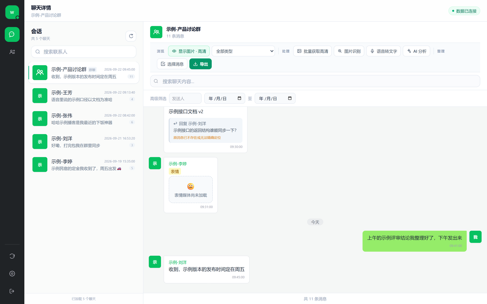
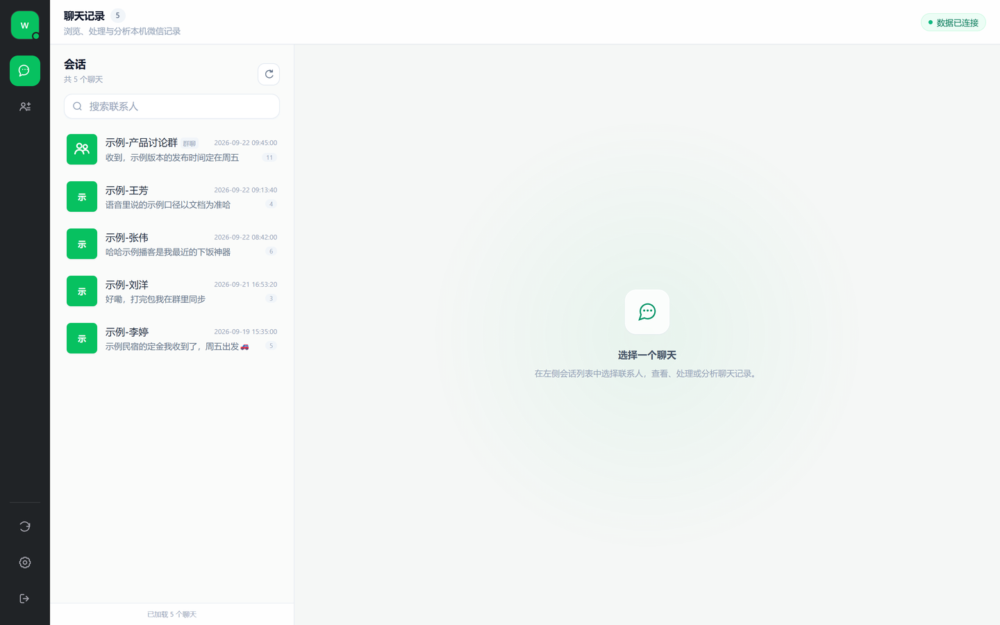
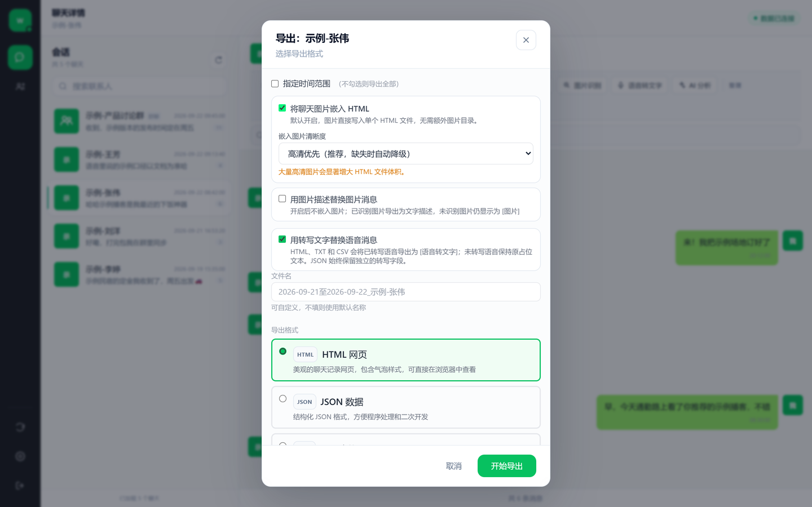
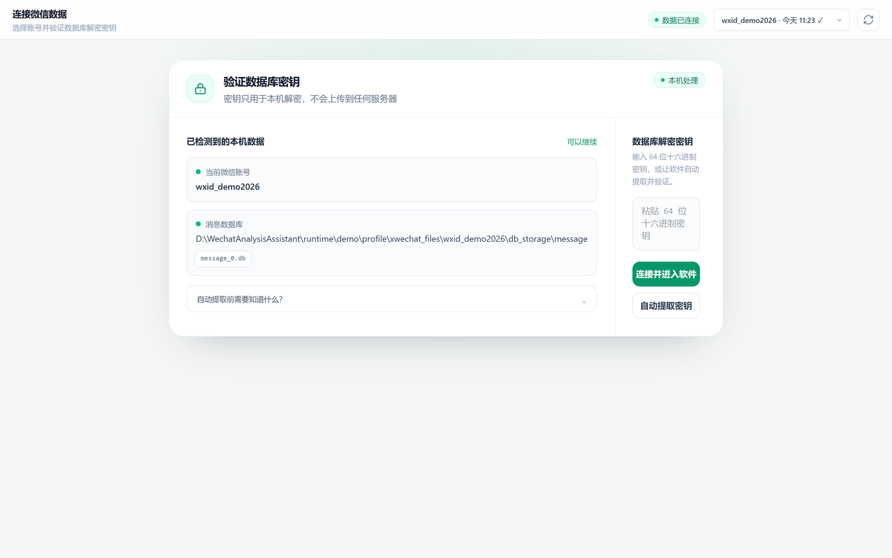
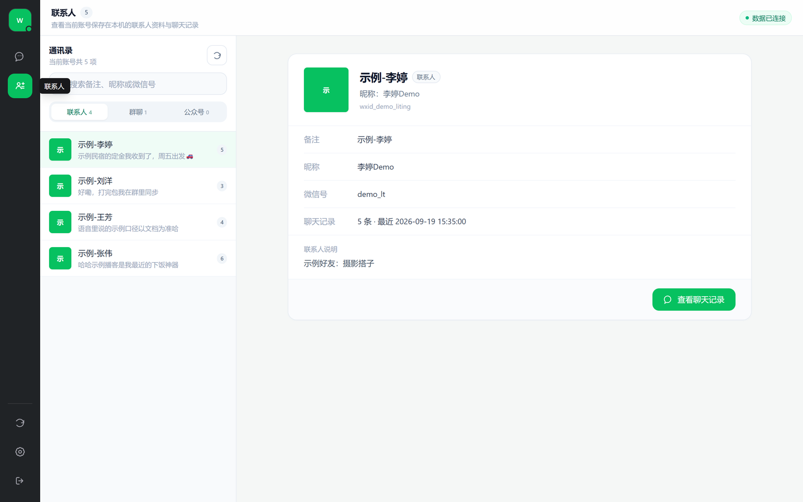

# 微信解析助手 WechatAnalysisAssistant

[](https://github.com/magicapple123/WechatAnalysisAssistant/actions/workflows/ci.yml)
[](https://github.com/magicapple123/WechatAnalysisAssistant/actions/workflows/codeql.yml)
[](https://github.com/magicapple123/WechatAnalysisAssistant/releases)
[](LICENSE)
[](#-快速开始)

一个用于**本地浏览、检索、导出与分析电脑版微信 4.x 聊天记录**的 Windows 工具，
提供 Electron 桌面端与源码启动的本机网页版。数据全部在本机解密与处理，
不提供任何托管服务、不上传聊天记录。

> [!IMPORTANT]
> 项目处于 Beta 阶段，仅支持 Windows 10/11 与电脑版微信 4.x。使用前请备份重要数据，
> 且只分析你有权访问的账号。**当前仅提供源码发行版**，不附带 Windows 安装包
> （原因见[数据、隐私与发布边界](#数据隐私与发布边界)）。



## 🎯 这个项目解决什么问题

微信官方不提供电脑端聊天记录的批量导出与检索。常见做法要么依赖手机端迁移工具，
要么把聊天记录交给第三方在线服务——后者意味着隐私风险。

微信解析助手把整条链路留在**你自己的电脑上**：读取本机数据库 → 输入解密密钥 →
浏览、搜索、导出、调用你自己配置的 AI 服务做分析。没有账号体系，没有云端中转，
没有隐藏上传。

**它刻意不做的事**：不破解微信、不调用私有接口、不注入微信进程（密钥提取仅读取
本机进程内存）、不提供任何在线托管版本。

## 🖼 界面一览

| 会话列表 | 导出对话框 |
| --- | --- |
|  |  |
| **连接与密钥验证** | **通讯录** |
|  |  |

更多界面：[群聊详情](docs/screenshots/03-chat-group.png) ·
[单聊](docs/screenshots/04-chat-direct.png) ·
[设置](docs/screenshots/06-settings.png)

## ✨ 功能特性

- 🔑 **密钥提取** — 从微信进程内存自动获取数据库解密密钥，验证通过后按账号保存
- 💬 **聊天浏览** — 仿微信风格浏览文字/图片/表情/语音/视频/红包/转账/引用消息
- 🔍 **全文检索** — 按关键词、消息类型、发送者、日期范围组合筛选
- 🖼 **图片解密** — 缩略图/高清切换，支持 wxgf/HEVC 等格式本机转码
- 📤 **多格式导出** — HTML（内嵌图片单文件）/ JSON / CSV / TXT，支持勾选与时间范围
- 🤖 **AI 能力** — 对接 16+ 视觉模型做图片识别、7+ 语音服务做转写、18+ 大模型生成
  聊天/朋友圈分析报告（使用你自己配置的 API，显式触发才联网）
- 🌄 **朋友圈** — 浏览与导出本机缓存的朋友圈快照、点赞与评论
- 🖥 **桌面端** — Electron 封装 + PyInstaller 后端，带自动更新通道

## 🔒 数据、隐私与发布边界

- **本地优先**：数据库解密、浏览、导出全部在本机完成；图片识别、语音转写、AI 分析
  仅在你显式触发后访问你自己配置的服务商，发送范围以确认弹窗为准。
- **密钥与配置**：解密密钥保存在 `%LOCALAPPDATA%\WechatAnalysisAssistant\`，
  普通接口只返回掩码，不回传密钥明文。
- **截图全部为虚构数据**：仓库中的界面截图由 `scripts/seed_demo_data.py`
  生成的演示账号（`wxid_demo2026`，所有联系人与内容均带「示例」标记）驱动真实
  界面拍摄，不含任何真实聊天记录。
- **发布边界**：PyAV 18.0.0 的 Windows wheel 携带无法满足公开再分发证明要求的
  x264/x265 组件，构建门禁会主动阻断二进制发布。因此项目**只发布源码**，
  不提供安装包；详情见 [THIRD_PARTY_NOTICES.md](THIRD_PARTY_NOTICES.md) 与
  [DESKTOP_RELEASE.md](DESKTOP_RELEASE.md)。

## 🚀 快速开始

**环境要求**：Windows 10/11 (x64)、Python 3.10+、Node.js 20.19+（推荐 22 LTS）、
电脑版微信 4.x 已在本机登录过。

### 一键启动（推荐）

双击 `restart.bat`。脚本会创建隔离 Python 环境、安装依赖、构建前端并打开浏览器
（默认端口 8520，被占用时会提示而不是杀进程）。

### 手动启动

```powershell
# 1. 后端依赖
py -3.12 -m venv .venv
.venv\Scripts\python.exe -m pip install -r backend\requirements.txt

# 2. 构建前端
npm --prefix frontend ci
npm --prefix frontend run build

# 3. 启动服务并访问 http://127.0.0.1:8520
.venv\Scripts\python.exe -m backend.main --port 8520
```

### 前后端开发模式

```powershell
.venv\Scripts\python.exe -m backend.main --no-browser   # 终端 1
npm --prefix frontend run dev                            # 终端 2 → http://localhost:3000
```

### 想复现仓库里的演示截图？

```powershell
.venv\Scripts\python.exe scripts\seed_demo_data.py          # 生成虚构演示账号
$env:WECHAT_ASSISTANT_DATA_DIR="$PWD\runtime\demo\appdata"  # 隔离真实密钥与配置
$env:USERPROFILE="$PWD\runtime\demo\profile"                # 隔离微信目录检测
.venv\Scripts\python.exe -m backend.main --port 8765 --no-browser
```

演示账号 `wxid_demo2026` 的密钥由脚本输出，连接后即可看到与仓库截图相同的界面。
删除 `runtime\` 目录即可完全清除演示数据。

## 📖 使用流程

1. **连接**：启动后在连接页选择微信账号，点击「自动提取密钥」或手动输入 64 位
   十六进制密钥（若使用内存提取，可能需要以管理员身份运行）。
2. **浏览**：左侧会话列表选择联系人，支持类型筛选、关键词搜索与日期过滤。
3. **处理**：工具栏按需使用批量获取高清图片、图片识别、语音转文字、AI 分析。
4. **导出**：选择格式（HTML/JSON/CSV/TXT）与范围，导出到设置中配置的目录。

各功能的详细说明（批量高清的热键与安全约束、朋友圈导出边界、模型服务商预设等）
见 [PROJECT_GUIDE.md](PROJECT_GUIDE.md) 与界面内的提示文案。

## 🧱 技术栈

| 层 | 技术 |
|----|------|
| 后端 | Python 3.10+ · FastAPI · Uvicorn · SQLite/WCDB 解密 |
| 前端 | React 18 · Vite 6 · Tailwind CSS 3 · Axios |
| 桌面 | Electron 43 · electron-builder · PyInstaller (onedir) |
| 媒体 | Pillow · pillow-heif · PyAV · pysilk |
| AI | OpenAI 兼容 / Anthropic / Gemini / DashScope 等多协议（用户自配） |

## 📁 项目结构

```
├── backend/          # FastAPI 后端（解密、解析、图片/语音/朋友圈、AI、导出）
├── frontend/         # React 网页端（src/components 为主要界面）
├── desktop/          # Electron 主进程、preload 与桌面测试
├── packaging/        # PyInstaller spec 与自定义 hooks
├── scripts/          # 构建、测试、发布安全检查、演示数据种子脚本
└── docs/screenshots/ # 由虚构演示数据驱动的界面截图
```

完整架构说明与修改指南见 [PROJECT_GUIDE.md](PROJECT_GUIDE.md)。

## 🧪 开发与测试

```powershell
.venv\Scripts\python.exe scripts\test-backend.py   # 后端隔离测试（不读真实微信数据）
.venv\Scripts\python.exe -m ruff check backend scripts --select F,E9
npm run check --prefix frontend                    # lint + 单测 + 构建
npm test --prefix desktop                          # Electron 测试
```

## ❓ 常见问题

**Q: 无法自动提取密钥？**
确保微信正在运行且已登录；尝试以管理员身份运行本工具；或改为手动输入密钥。

**Q: 会把聊天记录上传到服务器吗？**
不会。本工具没有服务端组件，所有数据处理在本机完成；只有你显式触发的 AI 识别/
转写/分析会访问你自己配置的模型服务。

**Q: 为什么没有安装包？**
见[发布边界](#数据隐私与发布边界)。源码运行即包含全部功能。

**Q: 支持微信 3.x 或 Mac 吗？**
不支持。仅支持 Windows 电脑版微信 4.x。

## 🤝 贡献

欢迎通过 Issue 反馈问题、通过 Pull Request 提交改进。提交前请阅读
[CONTRIBUTING.md](CONTRIBUTING.md) 与 [SECURITY.md](SECURITY.md)——不要在公开
Issue 中粘贴聊天记录、密钥或未脱敏日志，未修复的漏洞请按安全策略私下报告。

## ⭐ Star 历史

[](https://star-history.com/#magicapple123/WechatAnalysisAssistant&Date)

如果这个项目对你有帮助，欢迎点一个 Star，或在
[Discussions](https://github.com/magicapple123/WechatAnalysisAssistant/discussions)
分享你的使用场景与建议——功能优先级会参考真实反馈排序。

## 📄 许可证

项目源码按 [MIT License](LICENSE) 发布；第三方依赖遵循各自许可证，
再分发前请自行确认授权条款（见 [THIRD_PARTY_NOTICES.md](THIRD_PARTY_NOTICES.md)）。
